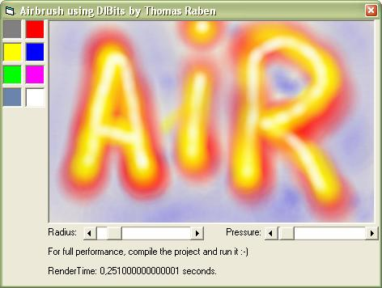



## Airbrush \(Very fast\)

### Description

This is a sample airbush using diBits. Veryfast, and easy to implement is paintprograms.
 
### More Info
 

             |
---                |---
**Submitted On**   |2002-07-29 10:51:34
**By**             |[Thomas Raben](https://github.com/Planet-Source-Code/PSCIndex/blob/master/ByAuthor/thomas-raben.md)
**Level**          |Intermediate
**User Rating**    |4.8 (29 globes from 6 users)
**Compatibility**  |VB 5\.0, VB 6\.0
**Category**       |[Graphics](https://github.com/Planet-Source-Code/PSCIndex/blob/master/ByCategory/graphics__1-46.md)
**World**          |[Visual Basic](https://github.com/Planet-Source-Code/PSCIndex/blob/master/ByWorld/visual-basic.md)
**Archive File**   |[Airbrush\_\(1119167292002\.zip](https://github.com/Planet-Source-Code/thomas-raben-airbrush-very-fast__1-37353/archive/master.zip)

### API Declarations

Some - see code

